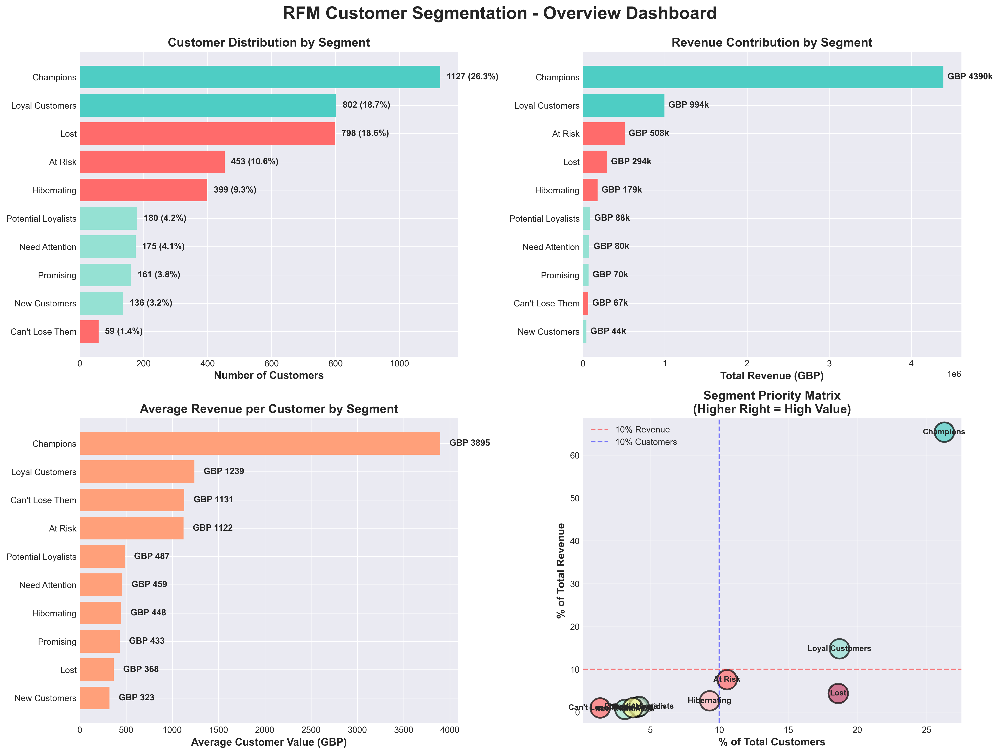
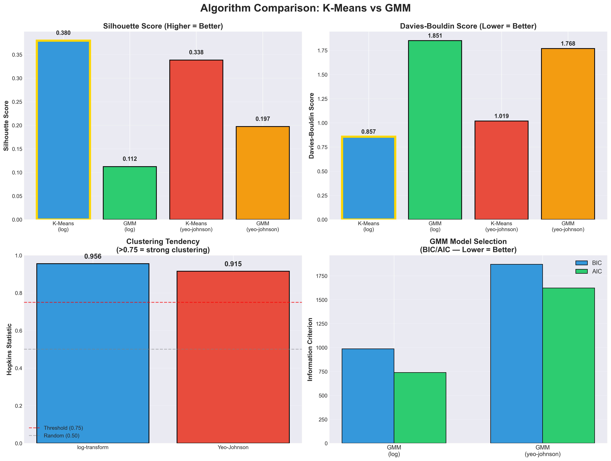
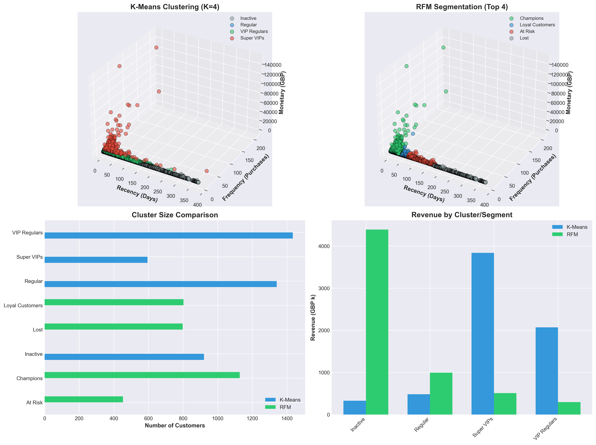
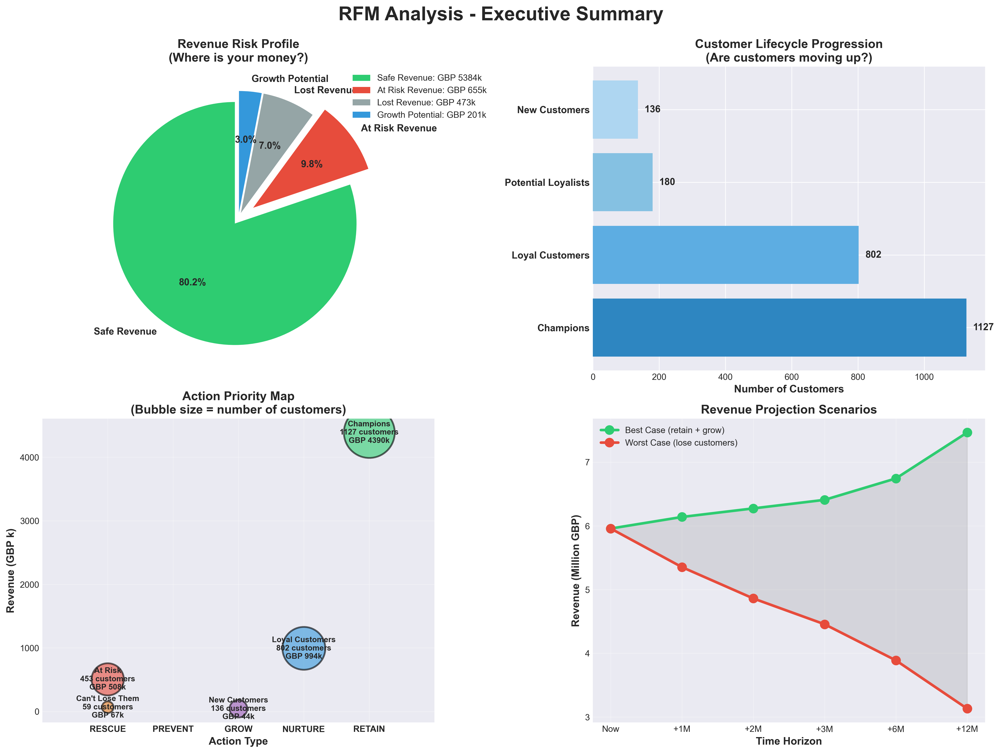
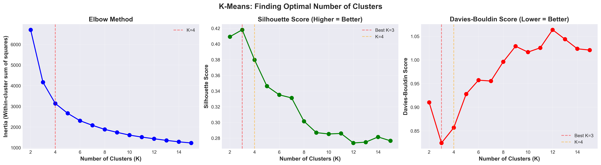

# RFM Customer Segmentation - ML-gesteuerter Ansatz

> **Sprache:** [English](README.md) | Deutsch

[](https://www.python.org/)
[](https://github.com/leelesemann-sys/rfm-customer-segmentation/actions/workflows/test.yml)
[](https://github.com/leelesemann-sys/rfm-customer-segmentation/actions/workflows/test.yml)
[](https://github.com/leelesemann-sys/rfm-customer-segmentation/actions/workflows/test.yml)
[](LICENSE)

> **End-to-End Kundenanalyse-Pipeline**, die 4.290 Kunden aus 6,7 Mio. GBP Einzelhandelstransaktionen mittels regelbasiertem RFM-Scoring und unueberwachtem Clustering segmentiert. Beinhaltet einen systematischen Vergleich von K-Means vs. Gaussian Mixture Model ueber mehrere Vorverarbeitungsstrategien.

---

## Geschaeftliche Auswirkung

| Kennzahl | Wert |
|--------|-------|
| Analysierter Gesamtumsatz | **6,7 Mio. GBP** ueber 394k Transaktionen |
| Identifizierte Champions | **1.127 Kunden** mit 4,4 Mio. GBP (65%) |
| Gefaehrdeter Umsatz | **575k GBP** von 512 gefaehrdeten Kunden |
| Umsetzbare Segmente | **10** mit massgeschneiderten Marketingstrategien |

---

## Was dieses Projekt besonders macht

Die meisten RFM-Analysen auf diesem Datensatz enden bei K-Means mit Standardeinstellungen. Dieses Projekt geht weiter:

1. **Algorithmenvergleich** -- K-Means vs. GMM, systematisch benchmarked
2. **Vorverarbeitungsvergleich** -- Log-Transformation vs. Yeo-Johnson Power Transform
3. **Statistische Validierung** -- Hopkins-Statistik (0,956) beweist Clusterbarkeit *bevor* Algorithmen ausgefuehrt werden
4. **Produktionsreifer Code** -- Wiederverwendbare `RFMPipeline`-Klasse, nicht nur ein Notebook
5. **Getestet und automatisiert** -- 61 Unit-Tests, GitHub Actions CI ueber Python 3.10-3.12
6. **Iterative Entwicklung** -- [v1.0](https://github.com/leelesemann-sys/rfm-customer-segmentation/releases/tag/v1.0) Baseline, dann [v2.0](https://github.com/leelesemann-sys/rfm-customer-segmentation/releases/tag/v2.0) mit Multi-Algorithmen-Vergleich ueber [dokumentiertem PR](https://github.com/leelesemann-sys/rfm-customer-segmentation/pull/1)

---

## Schnellstart

```bash
git clone https://github.com/leelesemann-sys/rfm-customer-segmentation.git
cd rfm-customer-segmentation
pip install -r requirements.txt

python run_pipeline.py                    # Vollstaendige Pipeline mit Standardwerten ausfuehren
python run_pipeline.py --k 5             # Andere Clusteranzahl ausprobieren
```

---

## Ergebnisse

### RFM-Segmente (Regelbasiert)



| Prioritaet | Segment | Kunden | Umsatz | Empfohlene Massnahme |
|----------|---------|-----------|---------|-------------------|
| Hoch | Champions | 1.127 | 4,4 Mio. GBP | VIP-Programme, Treuebelohnungen |
| Hoch | Gefaehrdet | 453 | 508k GBP | Rueckgewinnungskampagnen, 20% Rabatt |
| Hoch | Darf nicht verloren gehen | 59 | 67k GBP | Persoenliche Ansprache, Account Manager |
| Mittel | Treue Kunden | 802 | 994k GBP | Upselling, Cross-Selling |
| Mittel | Neukunden | 136 | 44k GBP | Onboarding, Anreiz fuer naechsten Kauf |
| Niedrig | Verloren | 798 | 294k GBP | Nur kostenguenstige Reaktivierung |
| Niedrig | Ruhend | 399 | 179k GBP | Massen-E-Mail-Kampagnen |

### Algorithmenvergleich



| Algorithmus | Transformation | Silhouette | Davies-Bouldin | Gewinner? |
|-----------|-----------|------------|----------------|---------|
| **K-Means** | **log** | **0,380** | **0,857** | **Bester** |
| K-Means | Yeo-Johnson | 0,338 | 1,019 | |
| GMM | Yeo-Johnson | 0,197 | 1,768 | |
| GMM | log | 0,112 | 1,851 | |

**Kernerkenntnis:** Entgegen Shobayo et al. (2023), die GMM als ueberlegen befanden (Silhouette 0,80 vs. 0,62), uebertrifft K-Means auf diesem Datensatz GMM. Die Log-Transformation macht RFM-Features annaehernd sphaerisch, was genau der K-Means-Annahme entspricht. Die Flexibilitaet von GMM (elliptische Cluster) fuegt Komplexitaet hinzu, ohne die Trennung zu verbessern.

### K-Means Cluster (K=4)



| Cluster | Groesse | Durchschn. Recency | Durchschn. Kaeufe | Durchschn. Ausgaben |
|---------|------|-------------|----------------|------------|
| Inaktiv | 921 | 260 Tage | 1 | 356 GBP |
| Regulaer | 1.341 | 59 Tage | 1 | 359 GBP |
| VIP Regulaer | 1.434 | 47 Tage | 4 | 1.442 GBP |
| Super VIPs | 594 | 19 Tage | 15 | 6.457 GBP |

### Dashboards




---

## Methodik

```
Rohdaten (541k Zeilen)
    │
    ├── 1. Datenbereinigung ─────────── 394k Transaktionen beibehalten (72,7%)
    ├── 2. RFM-Aggregation ──────────── 4.290 Kundenprofile
    ├── 3. Quintil-Scoring ──────────── R/F/M Scores (1-5 Skala)
    ├── 4. Regelbasierte Segmente ───── 10 Geschaeftssegmente
    ├── 5. Hopkins-Statistik ────────── 0,956 (Clustering validiert)
    ├── 6. Vorverarbeitung ──────────── Log-Transformation vs. Yeo-Johnson
    ├── 7. Algorithmenvergleich ──────── K-Means vs. GMM (4 Kombinationen)
    └── 8. Bestes Modell ────────────── K-Means + log (Silhouette: 0,380)
```

---

## Tech Stack

| Kategorie | Werkzeuge |
|----------|-------|
| Sprache | Python 3.11 |
| Daten | pandas, numpy |
| ML | scikit-learn (K-Means, GMM, Hopkins, Yeo-Johnson) |
| Visualisierung | matplotlib, seaborn |
| Testing | pytest (61 Tests), pytest-cov |
| CI/CD | GitHub Actions (Python 3.10, 3.11, 3.12) |

---

## Projektstruktur

```
rfm-customer-segmentation/
├── src/
│   ├── __init__.py
│   └── rfm_pipeline.py               # Wiederverwendbare Pipeline-Klasse (K-Means, GMM, Hopkins)
├── notebooks/
│   ├── 01_data_exploration.ipynb      # EDA & Datenbereinigung
│   └── 02_rfm_analysis.ipynb         # RFM-Scoring & Clustering
├── tests/
│   ├── conftest.py                    # Gemeinsame Test-Fixtures (50 synthetische Kunden)
│   └── test_pipeline.py              # 61 Unit-Tests ueber 10 Testklassen
├── visualizations/                    # 7 publikationsreife PNGs
├── data/
│   └── online_retail_clean.csv.zip   # Bereinigter Datensatz (394k Transaktionen)
├── run_pipeline.py                    # CLI-Einstiegspunkt (vollstaendige Pipeline + alle Visualisierungen)
├── .github/workflows/test.yml         # CI: Tests + Coverage Badge
└── requirements.txt
```

---

## Datensatz

**Quelle:** [UCI Machine Learning Repository -- Online Retail](https://archive.ics.uci.edu/dataset/352/online+retail)
**Zeitraum:** Dez. 2010 -- Dez. 2011 (12,4 Monate)
**Umfang:** 541.909 Transaktionen | 4.290 eindeutige Kunden | UK-basiert (89,1%)

---

## Versionshistorie

| Version | Aenderungen | PR |
|---------|-------------|-----|
| [v1.0](https://github.com/leelesemann-sys/rfm-customer-segmentation/releases/tag/v1.0) | Baseline: RFM + K-Means, 36 Tests, CI | -- |
| [v2.0](https://github.com/leelesemann-sys/rfm-customer-segmentation/releases/tag/v2.0) | +GMM, +Yeo-Johnson, +Hopkins, 61 Tests | [#1](https://github.com/leelesemann-sys/rfm-customer-segmentation/pull/1) |

---

## Geplante Erweiterungen

- [ ] Praediktives CLV-Modell (Random Forest / XGBoost)
- [ ] Abwanderungsvorhersage-Klassifikator
- [ ] Echtzeit-Segmentierungs-API (FastAPI)
- [ ] Interaktives Dashboard (Streamlit oder Power BI)

---

## Autor

**Lee Christian Lesemann**
Azure AI Engineer | Customer Analytics Consultant
*Zuvor: Sanofi, CSL Behring, Abbott, Teva Pharmaceuticals, IQVIA*

[](https://www.linkedin.com/in/leelesemann)

---

## Lizenz

MIT License -- siehe [LICENSE](LICENSE) fuer Details
