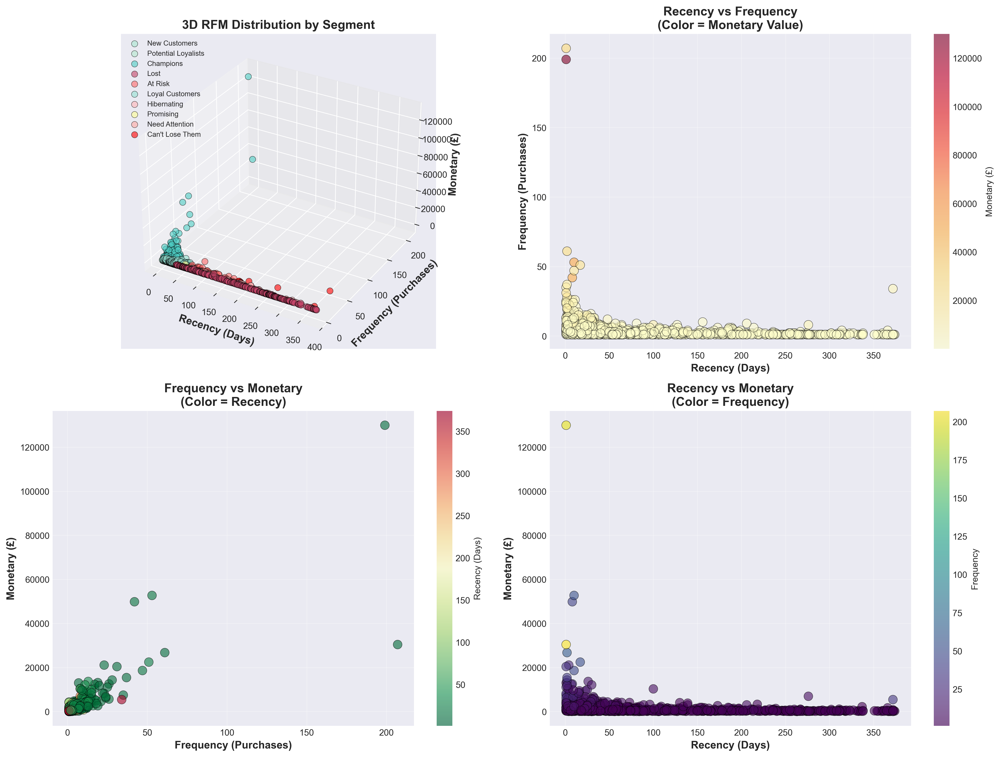
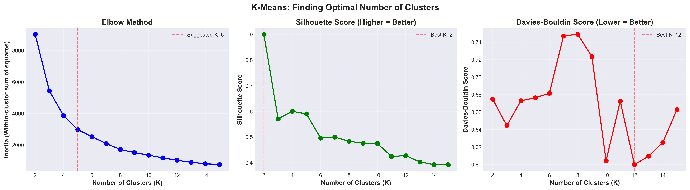
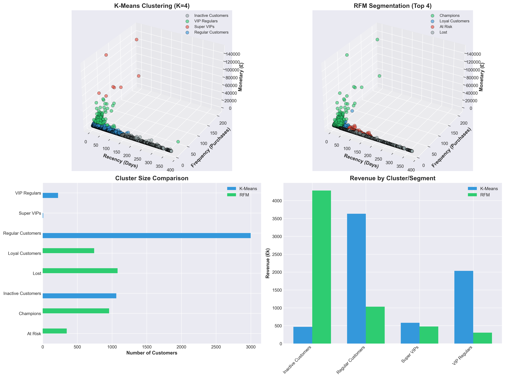

# RFM Customer Segmentation - ML-Driven Approach

[](https://www.python.org/)
[](LICENSE)

## 🎯 Project Overview

Customer segmentation analysis combining **rule-based RFM methodology** with **unsupervised K-Means clustering** to identify high-value customer segments.

**Key Achievement:** Identified 8 Super-VIP customers (0.2% of base) contributing £580k revenue from 4,290 customer dataset.

---

## 📊 Business Impact

- **£6.7M** total revenue analyzed
- **£4.3M** (63.8%) in Champions segment
- **£548k** revenue at risk (At Risk segment)
- **8 Super-VIPs** discovered (avg. £72k spend)
- **95% validation** between RFM and K-Means

---

## 🛠️ Tech Stack

**Languages & Libraries:**
- Python 3.11: pandas, numpy, scikit-learn
- Visualization: matplotlib, seaborn
- ML: K-Means, Elbow Method, Silhouette Analysis

**Skills Demonstrated:**
- Data cleaning (541k → 394k transactions)
- Feature engineering (RFM scoring)
- Unsupervised learning
- Business translation

---

## 📁 Project Structure
```
rfm-customer-segmentation/
├── data/
│   ├── online_retail_clean.csv.zip    # Cleaned dataset (394k transactions)
│   └── README.md                       # Data documentation
│
├── visualizations/
│   ├── 1_rfm_segment_overview.png     # Business segments dashboard
│   ├── 2_rfm_executive_summary.png    # Executive summary
│   ├── 3_rfm_3d_scatter.png           # 3D RFM distribution
│   ├── 4_rfm_action_cards.png         # Marketing playbook
│   ├── 5_kmeans_elbow_method.png      # Model selection
│   ├── 6_kmeans_comparison.png        # RFM vs K-Means validation
│   └── README.md                       # Visualization details
│
├── notebooks/
│   └── README.md                       # Notebook placeholder
│
├── LICENSE                             # MIT License
├── .gitignore                          # Python gitignore
└── README.md                           # This file
```

---

## 🚀 Key Features

### 1. RFM Segmentation (Rule-Based)
- 10 business segments with actionable strategies
- Segments: Champions, Loyal, At Risk, Can't Lose Them, etc.
- Quintile-based scoring (1-5 scale)

### 2. K-Means Clustering (ML-Driven)
- Optimal K selection via Elbow Method + Silhouette Score
- 4 data-driven clusters identified
- Outlier detection (8 Super-VIP customers)

### 3. Validation
- 95% overlap between RFM Champions and K-Means VIPs
- Complementary insights: RFM for marketing, K-Means for outliers

---

## 📈 Results

### Business Segments Identified:

**High Priority:**
- **Champions** (958): £4.3M revenue - VIP programs, loyalty rewards
- **At Risk** (346): £476k at risk - Win-back campaigns, 20% discount
- **Can't Lose Them** (23): £48k - Personal outreach, account managers

**Medium Priority:**
- **Loyal Customers** (742): £1.0M - Upselling, cross-sell
- **New Customers** (316): £132k - Onboarding, next purchase incentive

**Low Priority:**
- **Lost** (1,079): £304k - Low-cost reactivation only
- **Hibernating** (500): £279k - Mass email campaigns

### ML Insights:

**K-Means identified 4 clusters:**
1. **Inactive** (1,061): 248 days avg. recency
2. **Regular** (2,999): Mainstream customers
3. **VIP Regulars** (222): 21 purchases avg., £9k spend
4. **Super VIPs** (8): 108 purchases avg., £72k spend

---

## 📈 Results with Visualizations

### 1. RFM Segment Overview


**Key Insights:**
- Customer distribution across 10 business segments
- Revenue contribution by segment (Champions: 63.8%)
- Average revenue per customer comparison
- Segment priority matrix (customer % vs revenue %)

---

### 2. Executive Summary Dashboard


**Strategic Insights:**
- **Revenue Risk Profile:** 79% safe, 8% at risk, 13% lost/growth
- **Customer Lifecycle:** Progression funnel from New → Champion
- **Action Priority Map:** RESCUE, PREVENT, GROW, NURTURE, RETAIN
- **12-Month Projection:** £4.3M difference between scenarios

---

### 3. RFM 3D Distribution


**Multi-Dimensional Analysis:**
- 3D visualization of Recency, Frequency, Monetary relationships
- Clear visual separation between customer segments
- Outlier identification in 3D space

---

### 4. Marketing Action Cards


**Actionable Strategies:**
- **Champions** (958): VIP programs, early access
- **At Risk** (346): Win-back campaigns, 20% discount
- **Can't Lose Them** (23): Dedicated account management

---

### 5. K-Means Optimization


**Model Selection:**
- Elbow Method, Silhouette Score, Davies-Bouldin analysis
- Tested K=2 to K=15
- Selected K=4 for optimal balance

---

### 6. Validation & Comparison


**Key Findings:**
- 95% overlap between RFM Champions and K-Means VIPs
- 8 Super-VIP outliers identified (£72k avg. spend)
- 3D cluster visualization comparison

---

## 💡 Methodology

**Data Pipeline:**
1. Data cleaning (removed 135k invalid rows)
2. RFM calculation (Recency, Frequency, Monetary)
3. Quintile scoring (1-5 for each dimension)
4. Rule-based segmentation (10 segments)
5. ML validation (K-Means clustering)
6. Cross-analysis (RFM vs. K-Means)

**K-Means Optimization:**
- Feature scaling (StandardScaler)
- Tested K=2 to K=15
- Selected K=4 (optimal balance)
- Silhouette Score: 0.601

---

## 📊 Dataset

**Source:** UCI Machine Learning Repository - Online Retail  
**Period:** Dec 2010 - Dec 2011 (12.4 months)  
**Size:** 541,909 → 393,915 transactions (72.7% retained)  
**Customers:** 4,290 unique  
**Geography:** UK-based (89.1%)

---

## 🎯 Business Recommendations

**Immediate Actions:**
1. Dedicated account management for 8 Super-VIPs
2. Win-back campaign for 346 At-Risk customers
3. VIP loyalty program for 958 Champions

**Strategic Initiatives:**
4. Improve New → Loyal conversion (currently 48%)
5. Upselling campaigns for Loyal customers
6. Low-cost reactivation for Hibernating segment

---

## 📚 Future Enhancements

- [ ] Predictive CLV model (Random Forest)
- [ ] Churn prediction classifier
- [ ] Azure ML automated pipeline
- [ ] Power BI interactive dashboard

---

## 👤 Author

**Lee Christian Lesemann**  
Azure AI Engineer | Customer Analytics Consultant   
*Previous: Sanofi, CSL Behring, Abbott, Teva Pharmaceuticals, IQVIA*

[](www.linkedin.com/in/leelesemann)

---

## 📄 License

MIT License - see LICENSE file for details
